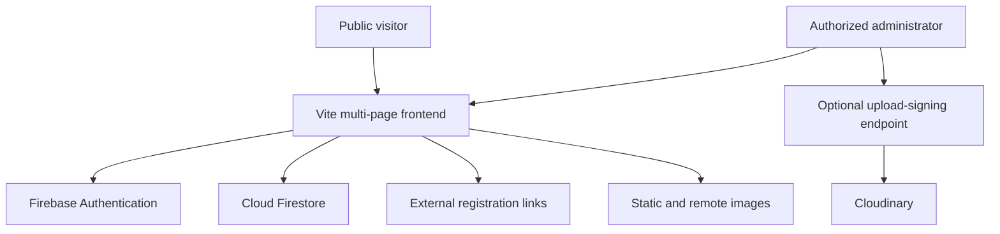
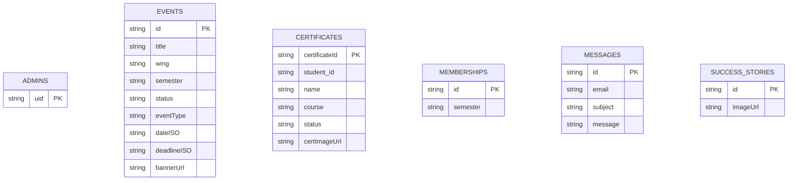
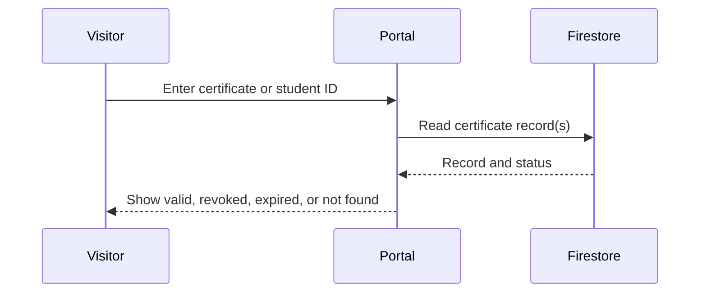

# DIU GCPC Portal

Official web portal for the Girls' Computer Programming Club (GCPC) at Daffodil International University.

[](https://gcpc.daffodilvarsity.edu.bd/)
[](https://vite.dev/)
[](https://firebase.google.com/)

The portal centralizes GCPC information, wing activities, event announcements, achievements, certificate verification, contact submissions, and selected administrative workflows. It is built as a multi-page Vite application using semantic HTML, CSS, client-side JavaScript, Firebase Authentication, and Cloud Firestore.

> **Project status:** Deployed organizational portal. Production security depends on Firebase Authentication configuration and Firestore/Storage rules maintained outside this repository.


## Live platform

**Website:** [gcpc.daffodilvarsity.edu.bd](https://gcpc.daffodilvarsity.edu.bd/)

## What the portal provides

### Public experience

- Club overview, committee information, wings, achievements, and galleries
- Separate pages for the ACM, Research, Career, and PR-oriented activities
- Upcoming and past event presentation backed by Firestore
- Event detail views and external registration links
- Certificate lookup by certificate ID or student ID
- Certificate status and optional certificate-image display
- Contact forms that create Firestore message records
- Light/dark theme persistence
- Responsive navigation, carousels, accordions, modals, and scroll restoration
- Clean routes for Apache/cPanel and platform-specific rewrites for Vercel

### Administrative experience

- Firebase email/password sign-in
- UID-based administrator lookup through `admins/{uid}`
- Event creation, editing, deletion, and banner references
- Certificate creation, editing, revocation/expiry status, and deletion
- Membership-submission and contact-message review when the corresponding Firestore collections are available
- Firestore-backed success-story image management


## System architecture



The application has no repository-hosted business-logic backend. Firebase services provide authentication and persistence, while Firestore Security Rules must enforce all read/write permissions.

## Firestore data model



The diagram documents collections referenced by the client. Firestore is schemaless, so field validation and authorization must be enforced through rules and trusted administrative workflows.

## Certificate-verification flow



Certificate lookup proves only that a matching record exists in the configured Firestore project. Its trustworthiness depends on restrictive rules that allow only authorized administrators to create or modify certificate records.

## Technology stack

| Layer | Technology |
|---|---|
| Markup and interface | HTML5, CSS3, JavaScript ES modules |
| Build system | Vite 5 |
| Authentication | Firebase Authentication |
| Persistence | Cloud Firestore |
| Storage client | Firebase Storage SDK initialized; file workflow is configuration-dependent |
| Optional event-image service | Cloudinary through a signed-upload endpoint |
| Hosting | cPanel/Apache, Vercel, or Netlify-compatible static hosting |
| Routing | Vite multi-page inputs, `.htaccess`, and host rewrites |

## Repository structure

```text
GCPC-DIU/
├── admin/                         # Administrative console
├── assets/
│   ├── app.js                     # Shared UI, Firestore, and admin logic
│   ├── firebase.js                # Firebase initialization
│   ├── config.sample.js           # Legacy/static-host configuration sample
│   ├── styles.css                 # Main design system
│   └── wing-*.svg                 # Wing illustrations
├── contact/                       # Contact page
├── home/                          # Additional home assets
├── join/                          # Membership information and external join link
├── public/                        # Build-time static assets
│   └── images/
│       ├── certificates/
│       ├── events/
│       └── success-stories/
├── verify/                        # Certificate-verification page
├── index.html                     # Main portal
├── event.html                     # Dynamic event detail view
├── wing-*.html                    # Wing pages
├── achievement-*.html             # Achievement pages
├── vite.config.js                 # Multi-page build configuration
├── vercel.json                    # Vercel routes
├── netlify.toml                   # Netlify configuration
└── .htaccess                      # Apache clean routes and HTTPS behavior
```

## Local development

### Requirements

- Node.js 18 or newer
- npm
- A Firebase project with Authentication and Firestore configured

### Installation

```bash
git clone https://github.com/anushka06onu/GCPC-DIU.git
cd GCPC-DIU
npm ci
```

Create `.env.local` from `.env.example`:

```env
VITE_FIREBASE_API_KEY=your_api_key
VITE_FIREBASE_AUTH_DOMAIN=your_project.firebaseapp.com
VITE_FIREBASE_PROJECT_ID=your_project_id
VITE_FIREBASE_STORAGE_BUCKET=your_project.appspot.com
VITE_FIREBASE_MESSAGING_SENDER_ID=your_sender_id
VITE_FIREBASE_APP_ID=your_app_id
VITE_FIREBASE_MEASUREMENT_ID=your_measurement_id
```

Start the development server:

```bash
npm run dev
```

Create and preview a production build:

```bash
npm run build
npm run preview
```

The verified build output is written to `dist/`.

## Firebase setup

1. Enable Email/Password in Firebase Authentication.
2. Create the Firestore collections needed by the enabled workflows.
3. Add each authorized administrator as a document at `admins/{firebaseAuthUid}`.
4. Deploy restrictive Firestore rules before exposing the application publicly.
5. Restrict public reads to the minimum fields and collections required by the website.
6. Allow administrative writes only when the authenticated UID has an authorized administrator record.
7. Add App Check, quotas, and abuse controls for public forms where appropriate.

> Firebase web configuration is intentionally visible in browser applications and is not a substitute for authorization. The actual protection must come from Firebase rules, Authentication, App Check, and restricted service configuration.

## Hosting

### Vercel

Configure the `VITE_FIREBASE_*` variables in the project settings and deploy. `vercel.json` builds the Vite application into `dist/` and supplies clean-route rewrites.

### Apache/cPanel

Run `npm run build`, upload the contents of `dist/` to the target web root, and retain the generated `.htaccess` file. Environment variables must be injected during the build; they are not read dynamically by a static site after deployment.

### Netlify

Configure the same build-time variables, use `npm run build`, and publish `dist/`.

## Optional Cloudinary upload

The event editor can request a signed upload from:

```text
POST /api/cloudinary-sign
```

That endpoint is **not included in this repository**. File upload will work only after a trusted backend or serverless function returns a Cloudinary upload URL and signed fields. Never place a Cloudinary API secret in client-side JavaScript. Administrators may instead save an already-hosted image URL.

## Current limitations

- Firestore and Storage rules are not versioned in the repository, so production authorization cannot be independently audited here.
- The public Join page redirects to the official DIU Student Hub; it does not create membership records itself.
- There is no automated test suite or Firebase Emulator test suite.


## Roadmap

- Commit tested Firebase rules and indexes
- Add Firebase Emulator and end-to-end tests
- Implement or remove the signed Cloudinary upload control
- Replace hard-coded membership statistics with clearly sourced live data
- Add certificate audit history and downloadable QR verification links
- Add moderation, retention, and privacy controls for submitted data
- Consolidate legacy assets and remove packaged build archives from source control
- Optimize large images and add automated image processing
- Add CI for build, linting, accessibility checks, and link validation

## Responsible use

This portal handles organizational records and may process student identifiers, contact messages, and membership information. Deployers are responsible for obtaining appropriate permission, limiting data collection, protecting personal information, and keeping certificate and administrator records accurate.

## Author

Developed by **Fateha Hossain Anushka** for the DIU Girls' Computer Programming Club.

## Institutional note

The live domain and institutional branding should be used only with authorization from Daffodil International University and GCPC. Repository documentation does not itself constitute institutional endorsement.
